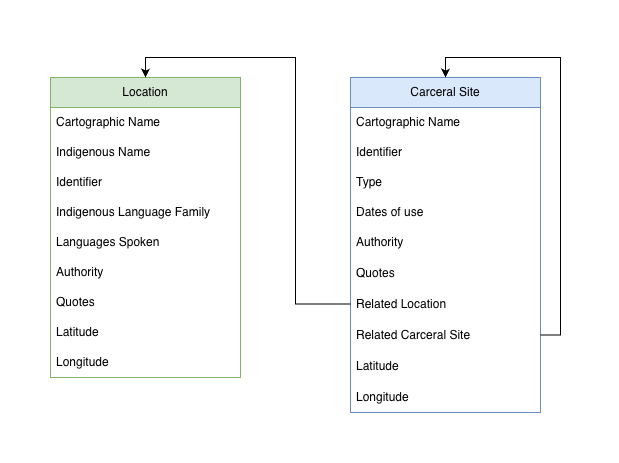
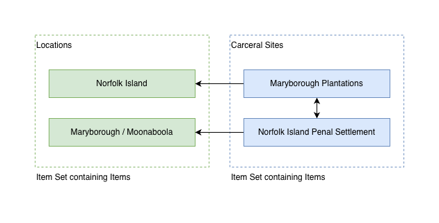
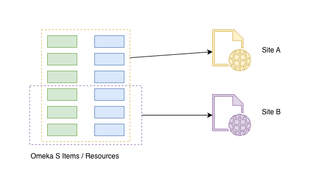

# Basic concepts

This section is going to cover some basic Omeka S vocabulary and
a rough mental model of how I've imported the latest version of
the Carceral Archipelago spreadsheet.

Omeka S is a web-based platform for creating and storing collections of
items and their relationships, and for publishing these collections as
websites.

An item is very general - it can be anything you need it to be for your
research. In the Carceral Archipelago collection as it stands now,
we've got two primary sorts of items: Locations and Carceral Sites.

This is the kind of diagram technology people like to draw when we're
thinking these things through - it shows you two sorts of thing, a
location and a carceral site, and the properties which each one of them
has. The arrows between them show how they can be related to one another.

The data model here is not dependent on Omeka S - it's just a way of
organising how we want to represent the collection.

In traditional databases, these sorts of tables and their relationships
get designed up front, and all of the data which gets imported has to fit into that pre-baked mould. Omeka S is less restrictive than that, although
as we'll see, it still requires a bit of standardisation.

Items are sometimes referred to in Omeka S as "resources" - the term
"resource" is more general because it can be either a single item, or
a collection of items, which in Omeka S is an item set. For this workshop
we'll mostly be talking about items, but some of the interfaces will
call them resources.

This diagram shows four of the items which I've imported into Omekas S -
two of them are locations and two are carceral sites. I've adde all of
the items to two item sets, one for the locations and one for the
carceral sites.

The arrows on this diagram show some of the relationships - all of
the carceral sites belong to a location, and some of the sites are
related to one another.

This diagram is zoomed out even further - on the left the coloured
rectangles are meant to show all of the items in the Omekas S collection.

On the left are two "Sites" - these are website which public users
can visit to look at the items in the collection, plus other
supplementary materials. We can have multiple sites, each of which has
its own set of resources from Omeka S - this is what the yellow and
purpled dotted lines mean.

We'll be using this feature in the final part of the website when we
each set up our own site on the same Omeka S.

