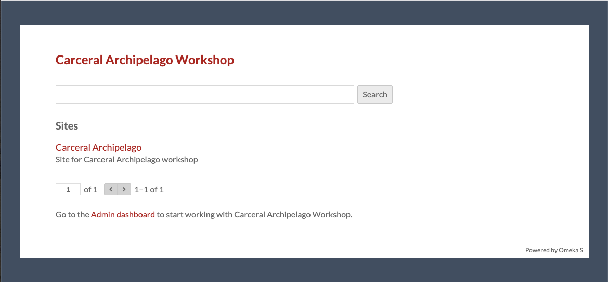
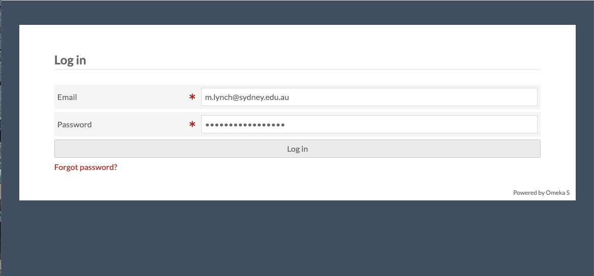
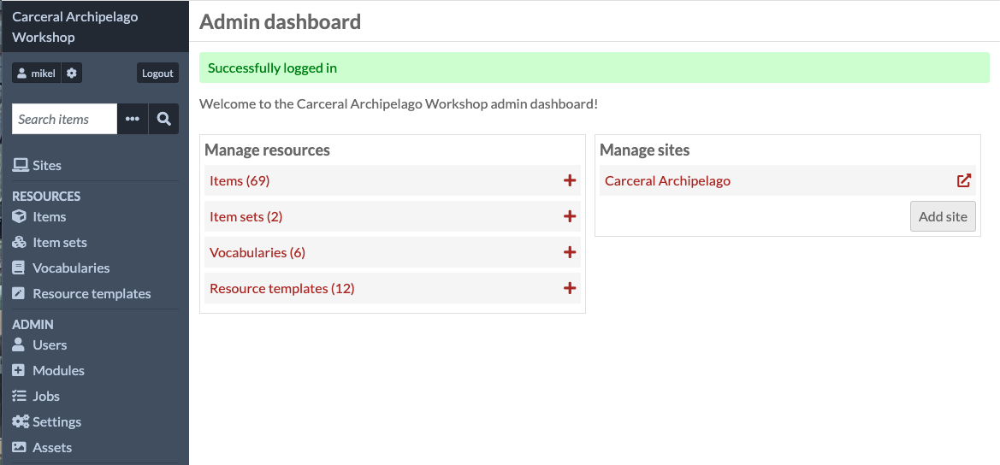

# Logging in

We'll start by going to the Omeka S which I've prepared for this
workshop:

[carceral-workshop.curated-collections.cloud.edu.au](https://carceral-workshop.curated-collections.cloud.edu.au/)

This is a _very_ long URL because it's the default provided by the
national research cloud we're running on. We'll be getting a Curated
Collections domain soon.  And, eventually, we will be able to give
collections their own custom domains.

Click the *Admin dashboard* link and log in with the credentials which
we gave you last week:

Once you've logged in, you should see the admin dashboard, which
looks like this:

The left hand side of the admin dashboard is how you navigate around
Omeka S. There are four main sections of this - for today we're only
going to be using the first two.

"Sites" (under the search box) is where you set up and edit the
public-facing websites based Omeka.

"Resources" (the next section) is where you can edit and add the actual
items which the websites are based on.

The main page of the dashboard also has these two broad sections: under
"Manage Resources" are summmaries of what's contained in this Omeka S,
and under "Manage Sites" is one website. Later I'll get you to each
create your own site in this section.

In the next section, we'll look at the items in more detail, so click
on the "Items" link in the admin dashboard.
