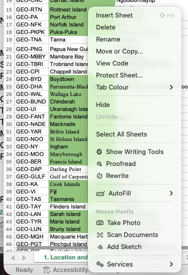
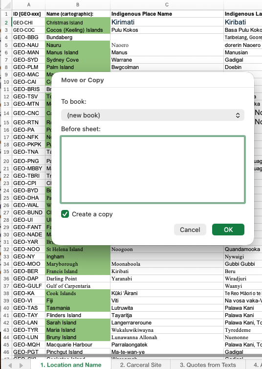
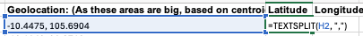
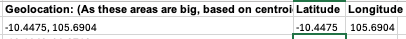
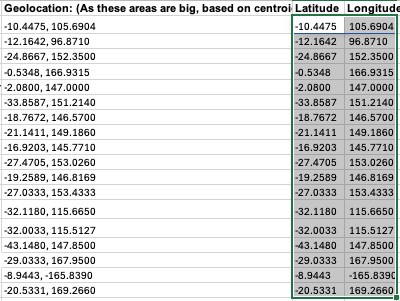
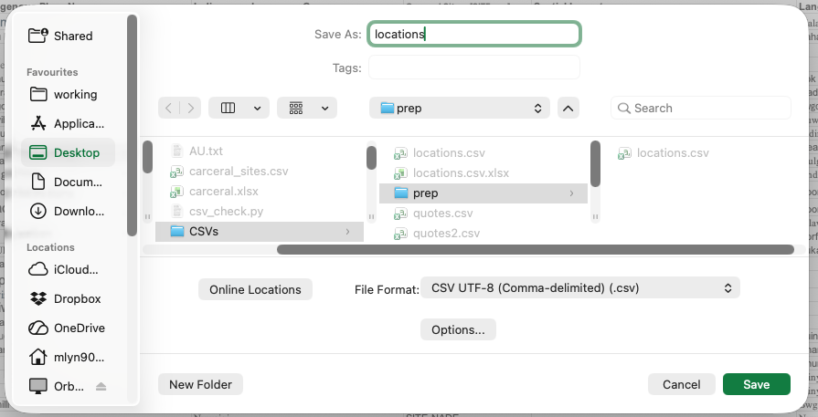

# Preparing the CSV

We are going to start by taking one worksheet from the spreadsheet and
importing it into Omeka S. We'll start with the Locations worksheet.

Each location will be represented by an item in Omeka S - you can think
of these as entities or rows in a database.

Omeka has to have its data as a CSV file before we upload it - so to
start with we'll make a copy of the Locations worksheet in Excel.

You can do this by right-clicking on the Locations worksheet tab and
selecting "Move or copy".  In the window which appears, pick "(new book)"
because we want to create a new CSV file, and tick "Create a copy" so
that we don't remove the worksheet from the original file.

In the original spreadsheet, the geolocations are stored in a single
column as comma-separated values. Omeka S needs these to be in two
columns. Excel provides a formula, TEXTSPLIT(), which we can use to
add two new columns with the separated values.

We type "=TEXTSPLIT(" in the column to the right of the first geolocation,
and Excel lets us select which cell we want to use as the input. We also
need to tell Excel to use commas as the delimited.

If all goes to plan we will get two new values in the next two columns:

Now we can drag those two columns down to apply the formula to the rest
of the geolocations.

We should also add "Latitude" and "Longitude" as column headings, as this
will help identify the right columns when we're importing the CSV.

Finally, we need to save our new spreadsheet as a CSV - select "Save
As" and use the "File Format" dropdown to select CSV UTF-8.

Give it the name "locations.csv"

