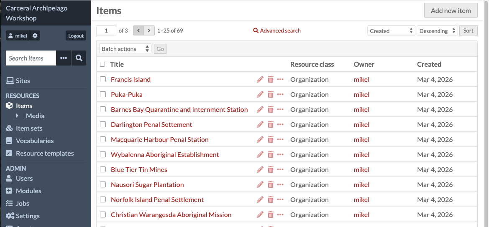
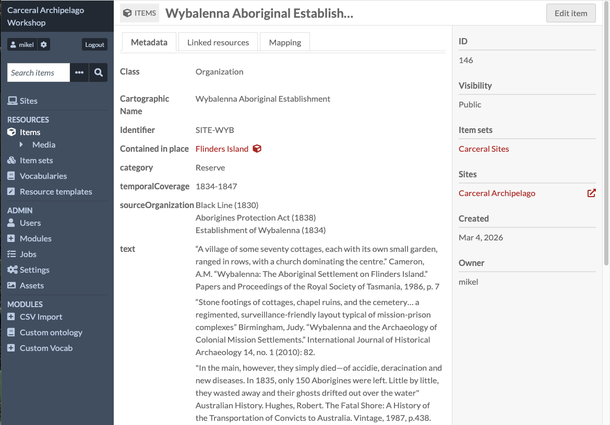
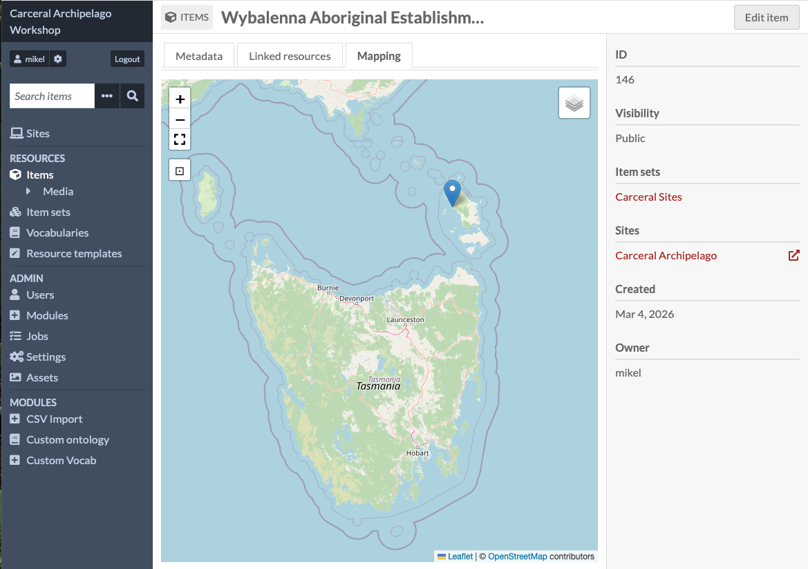

# Items

Items are the things we work with most in Omeka S. This shows the list
of items which were imported from the Carceral Archipelago spreadsheet.

You can click any of the titles of these items to view it in more
detail.

An item view has three tabs - the first, Metadata, shows the information
which was imported.

"Metadata" is a bit of a holdover from Omeka S' origins as a system for
managing collections in museums and galleries - where the primary "thing"
is an artefact or images or scans of document, and other information
about it, such as where it was discovered, who created it, or its dates,
are "metadata".

For a collection like Carceral Archipelago and most of the other
collections in Curated Collections, this metadata is the primary thing
we're interested in.

An item's data is a collection of properties - like "Cartographic Name"
and "identifier" - and values, like "Wyabalenna Aboriginal Establishment"
or "SITE-WYB"

The other two tabs are "Linked Resources" and "Mapping". We'll leave
Linked resources for now and click on "Mapping"

This tab shows you the location data stored against the item.

By default the map is zoomed in too close to be much use - if you click
the icon with the minus sign, or use your scroll wheel or scroll pad,
you can zoom out and see where the item is located.

We're now going to look at how you edit an item - to do this, click the
"Edit item" button in the top right of the page.

