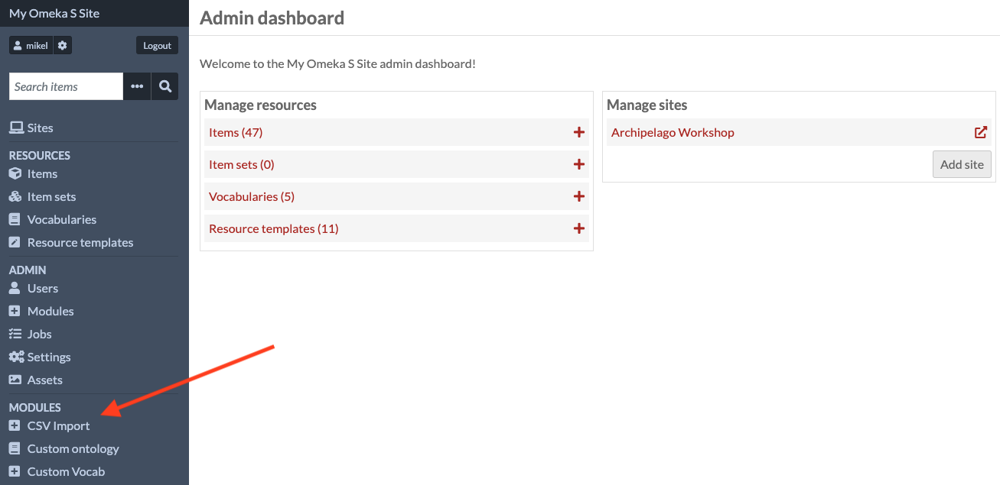
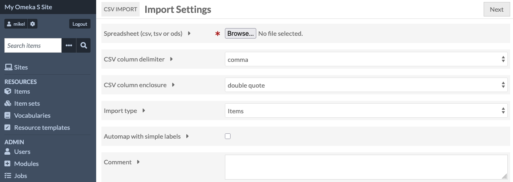
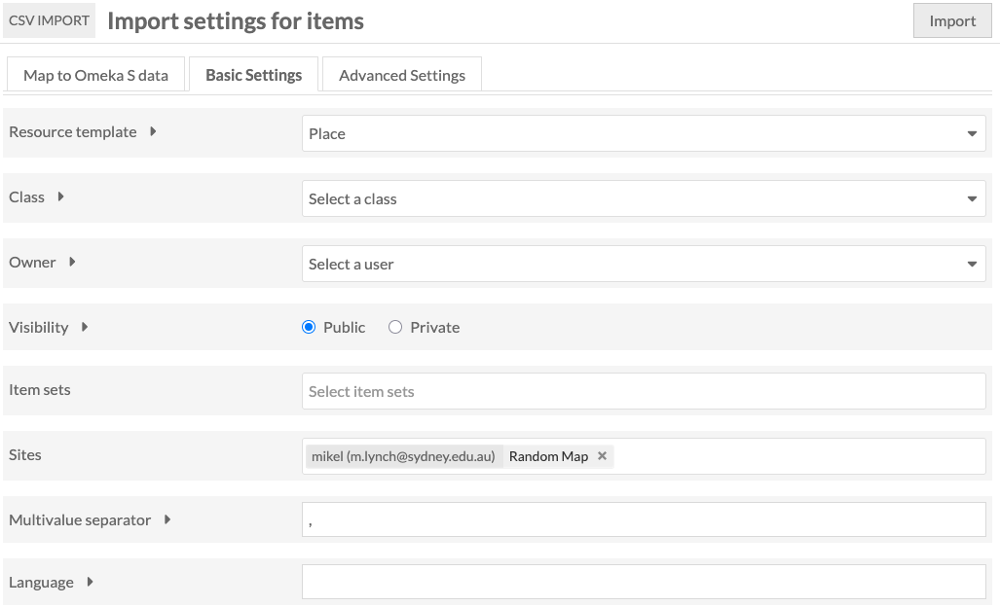
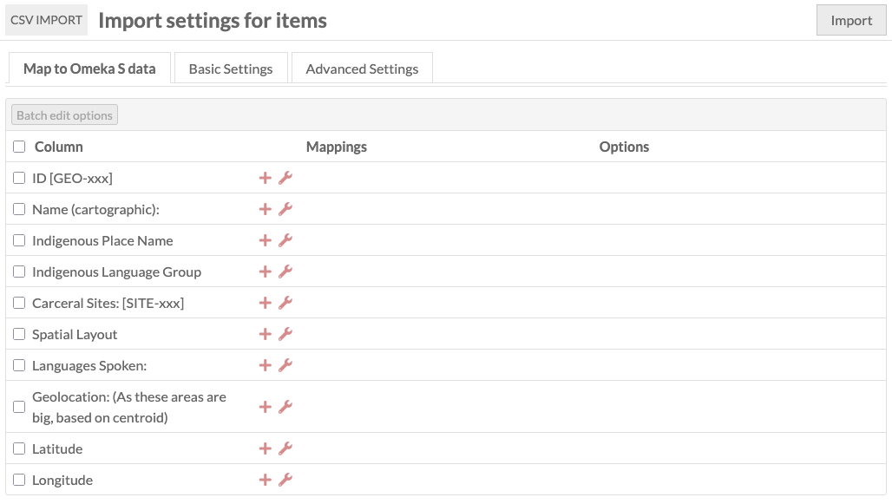
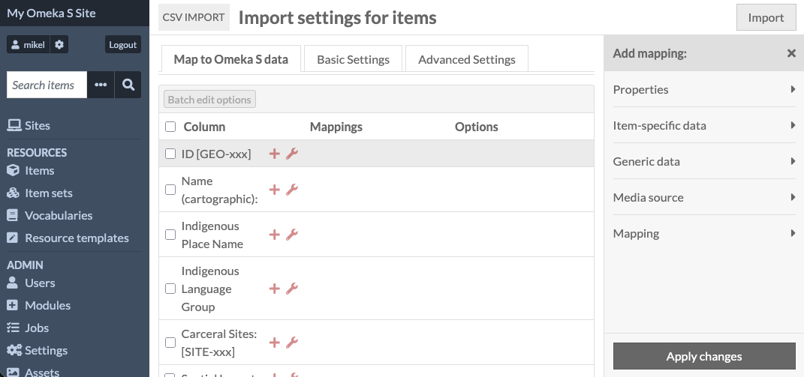
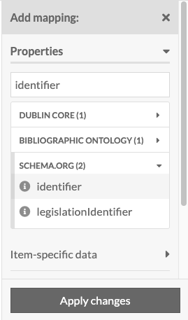
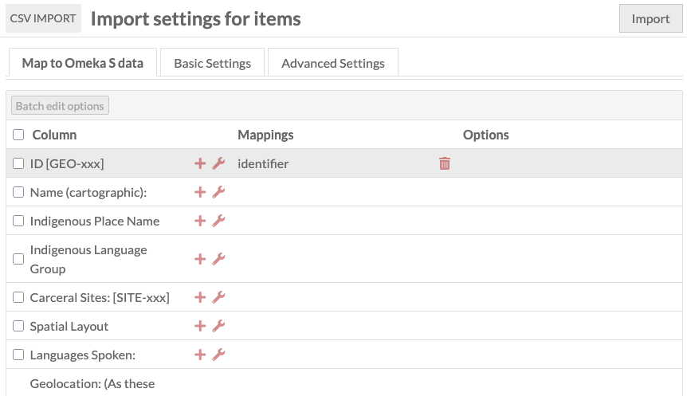
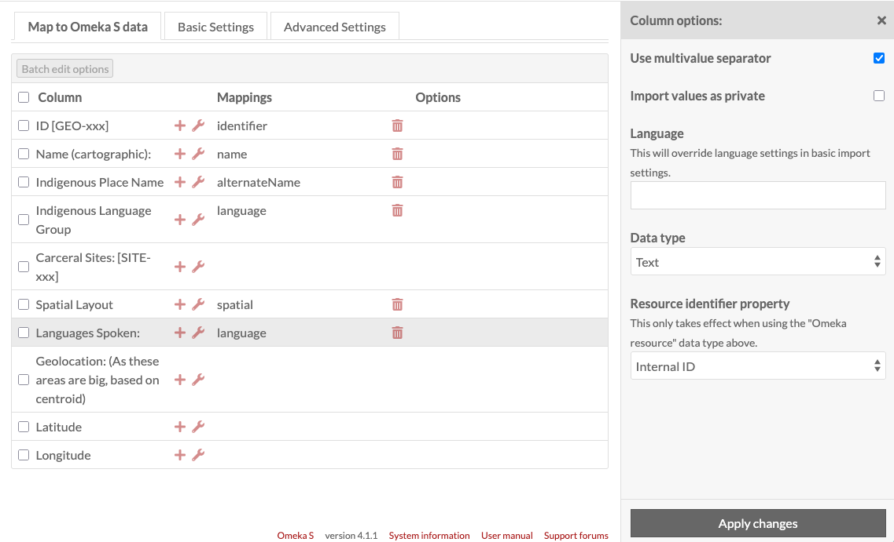
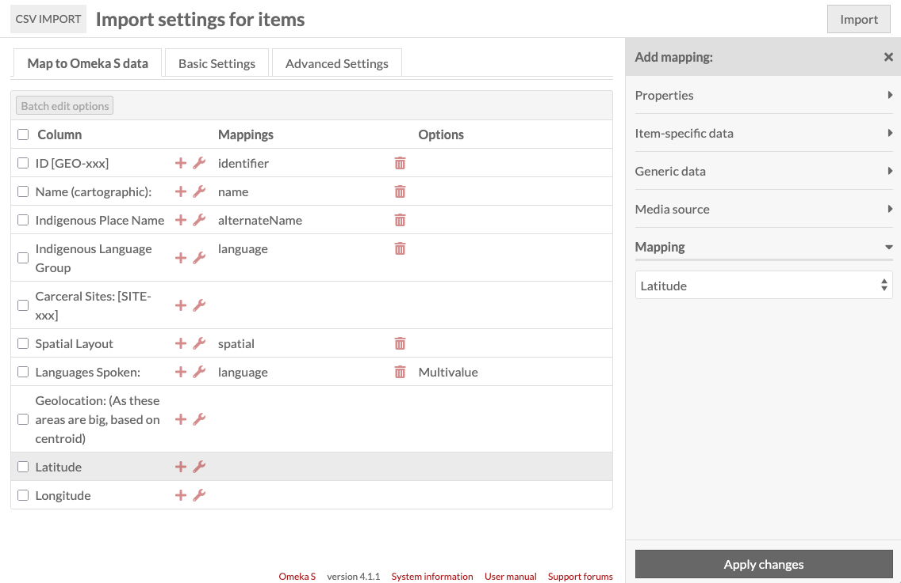

# Upload resources

We'll now uploade the CSV file with the loccations to Omeka S, where
they'll be created as items. We'll create them using an existing
resource template in Omeka S for describing places.

Omeka S comes with some pre-installed templates for resources - these
are recommended because they use standard vocabularies for their field
names, which is important for long-term preservation - eventually we'll
be exporting collections to an archival format, and the standard
vocabularies mean that those archives will be accessible for future
platforms.

When importing tabular data into Omeka S, we want to be able to use Omeka's
ability to automatically create links based on identifiers in the
spreadsheet.

So when we import the second spreadsheet, representing carceral sites,
we'll tell Omeka S to look up the location by its ID, and create
links in the database automatically.

For this to work, we need to think about the order in which we import
the different tables - we'll import the locations and then the carceral
sites.

To start the import process, click "CSV Import" near the bottom of the
navigation panel.

We need to go through a couple of pages for this to tell Omeka S how to
map spreadsheet rows to resources.

The first page lets us select the file, and set some basic parameters
for the CSV - the default values for these are fine.

The next page will have a table for each column in the spreadsheet you've
just uploaded. We need to map these onto values for the resources.

Before we start this, we'll select a resource template for Omeka S to
use when creating the new items. Select the "Basic Settings" tab at the top, and select "Place" from the drop-down next to "Resource template"

Once we've selected Place, click the "Map to Omeka S Data" to go back to the list of spreadsheet columns.

Note that in this part of Omeka S's interface, the word 'map' is used
in two completely different senses. One is the normal, everyday sense of
putting records onto a map so that we can see where they are
geographically.

The other sense comes from maths and computer science, and it means taking
a set of fields in one system and defining where their values are going
to go in a second system.

This correspondence - in our case, between columns in a CSV, and fields
in items in Omeka S - is called a "mapping", and it's in this sense that
the heading on this page uses it in when it says "Map to Omeka S data"

We need to assign an Omeka metadata field to each of the columns in our
CSV. To do this, click on the + icon next to the first column, "ID [GEO-xxx]": this opens a panel with the header "Add mapping".

Clicking on the Properties item lets us search the fields which are
available for this resource template.

For identifier, we should pick "identifier" from schema.org -
there's also an "Identifier" from Dublin Core and it's important that
we stay consistent, so that when we upload our second CSV, Omeka can
link the resources automatically.

NOTE - you need to click the "Apply changes" button! I always forget this.

If the changes are applied, the column "ID" will have "Identifier" next
to it under "Mappings":

We now need to do this for the other fields. If you scroll to the
bottom of this page, there's a screenshot with the fields I selected.

Some of the preset fields may not be exactly what your project needs -
if required, it's possible to set up a resource template with the
appropriate values.

Next to the + icons are spanner icons which allow us to customise the
way each field mapping works. 

One is the link to Carceral sites - as these haven't been uploaded yet,
we can't expect Omeka S to find them, so we're going to try to create
reverse links when we upload the sites.

The other is Geolocation. As we've split the latitude and longitude into
two extra columns, we don't need to map the original. Instead, we use
the Mapping item in the field panel to tell Omeka to assign the latitude
and longitude to the item's spatial information

Once this is done, our mapping screen should look like this, and we're
ready to click the Import button at the top right.

 

