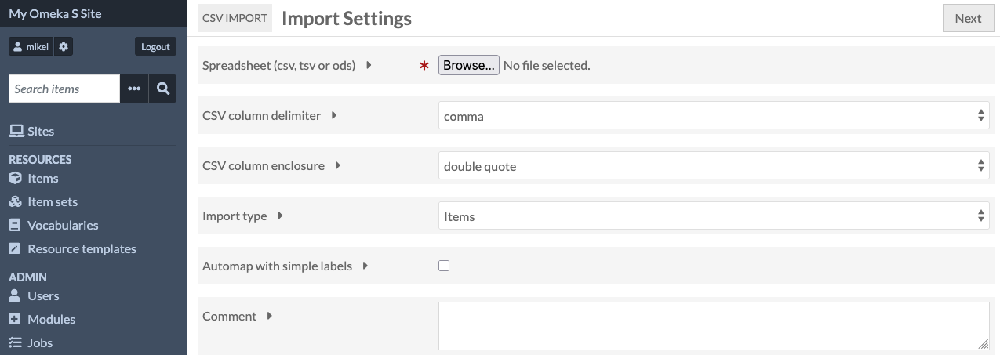
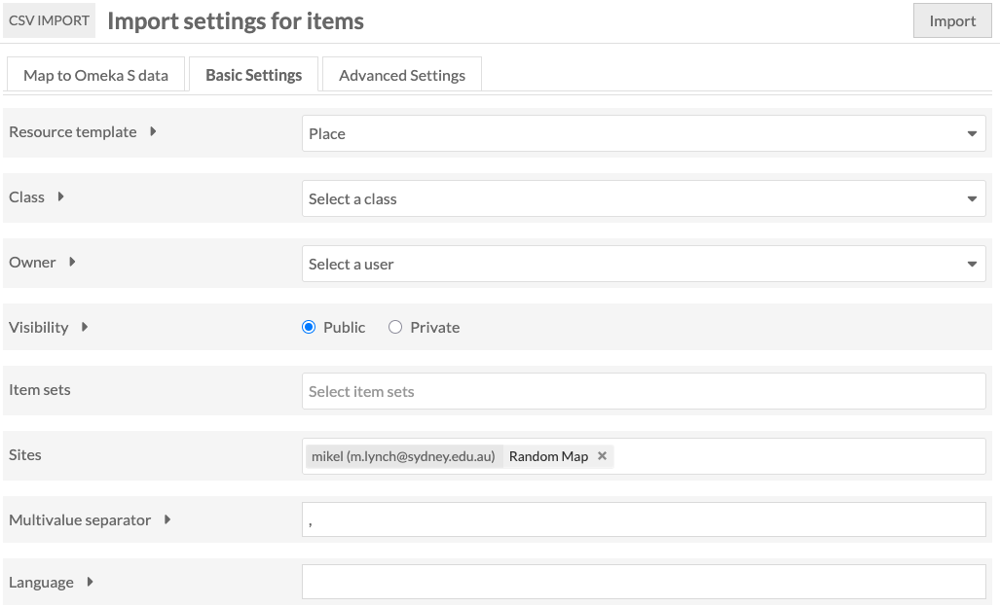

# Upload resources

We're now going to take one spreadsheet and use it to create a set of
resources in Omeka S and add them to the site we've just created.

Omeka S comes with some pre-installed templates for resources - these
are recommended because they use standard vocabularies for their field
names, which is important for long-term preservation - eventually we'll
be exporting collections to an archival format, and the standard
vocabularies mean that those archives will be accessible for future
platforms.

We're going to start with the locations spreadsheet and use them to
create "Place" resources in Omeka S.

Before we start this - when importing tabular data into a system like
Omeka S, we want to be able to use Omeka's ability to create links based
on identifiers in the spreadsheet.

So when we import a row representing a quotation, we'll tell Omeka S to
look up the carceral site and geolocations by their ID, and create
links in the database automatically.

For this to work, we need to think about the order in which we import
the different tables - today I'm going to import the locations, the
carceral sites and quotations, in that order.

To start the import process, click "CSV Import" near the bottom of the
navigation panel.

We need to go through a couple of pages for this to tell Omeka S how to
map spreadsheet rows to resources.

The first page lets us select the file, and set some basic parameters
for the CSV - the default values for these are fine. Click "Next" when
you've found the spreadsheet.

The next page will have a table for each column in the spreadsheet you've
just uploaded. We need to map these onto values for the resources.

Before we start this, we'll select a resource template for Omeka S to
use when creating the new items. Select the "Basic Settings" tab at the top, and select "Place" from the drop-down next to "Resource template"

Notice that there's also a "Sites" field on this page, which should have
your new site as its value.

Once we've selected Place, click the "Map to Omeka S Data" to go back to the list of spreadsheet columns.

Click the + icon next to "ID [GEO-xxx]" and a panel with the header
"Add mapping". Click the "Properties" drop down and search for a property
called "Identifier"

NOTE - you need to click the "Apply changes" button! I always forget this.

If the changes are applied, the column "ID" will have "Identifier" next
to it under "Mappings"

We now need to do this for the other fields, with two exceptions

One is the link to Carceral sites - as these haven't been uploaded yet,
we can't expect Omeka S to find them, so we're going to try to create
reverse links when we upload the sites.

The other is Geolocation - I've split the latitude and longitude into
two columns, and use the Mapping tab to tell Omeka to use this as spatial
information

