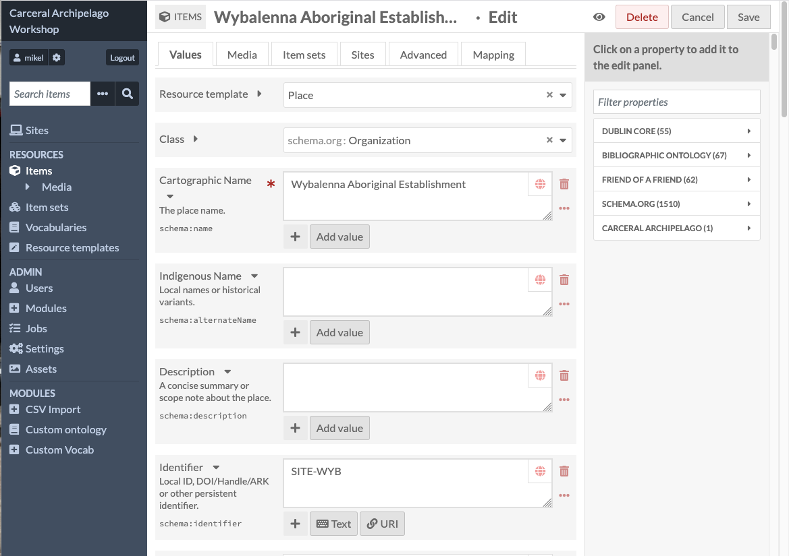
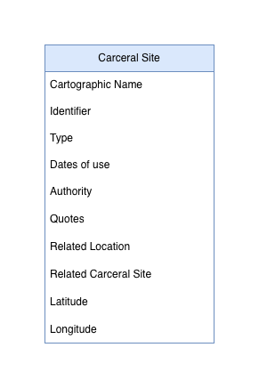
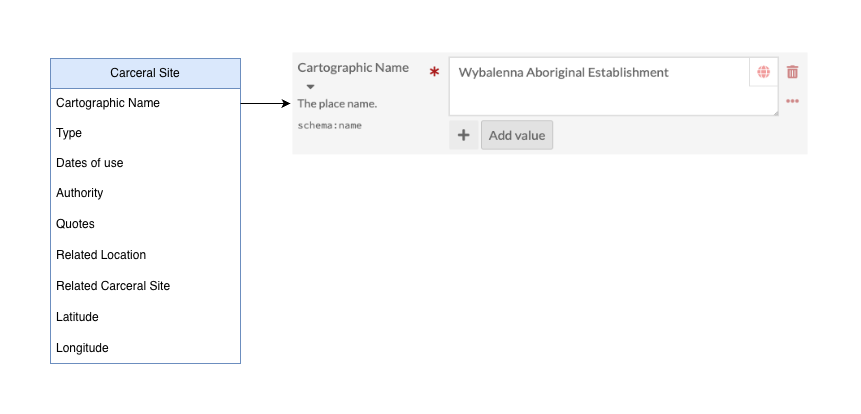
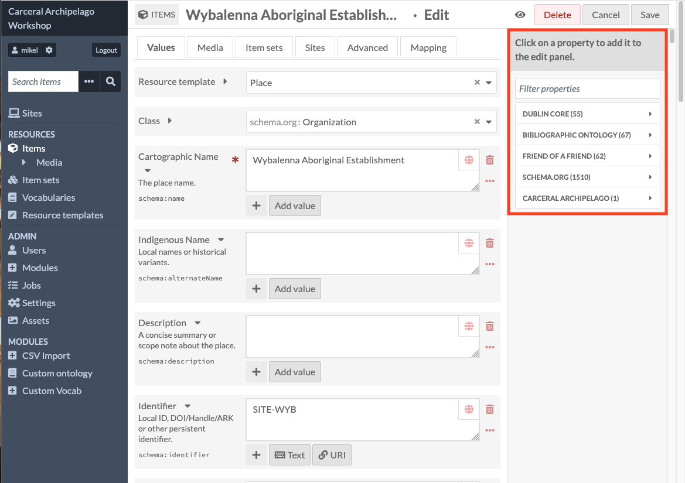
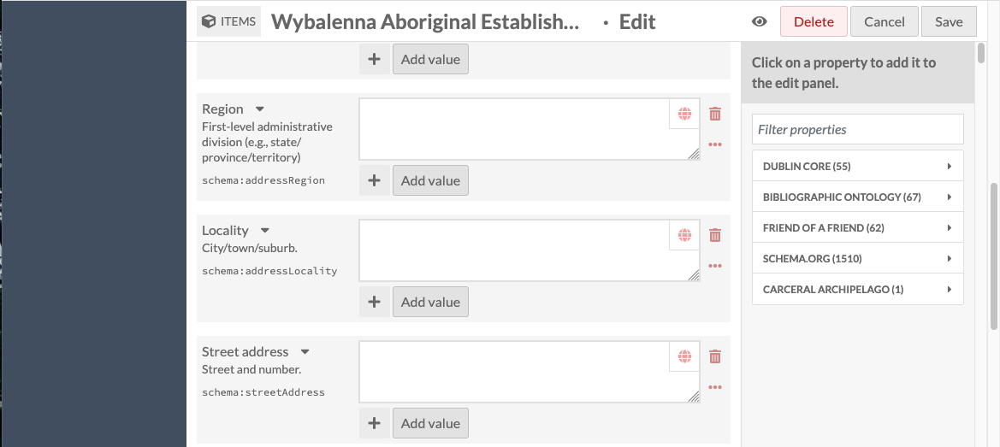
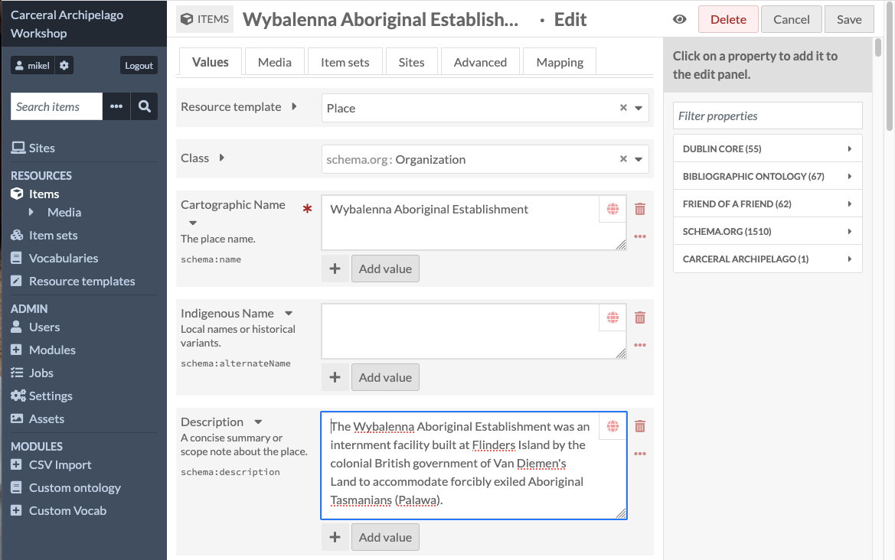
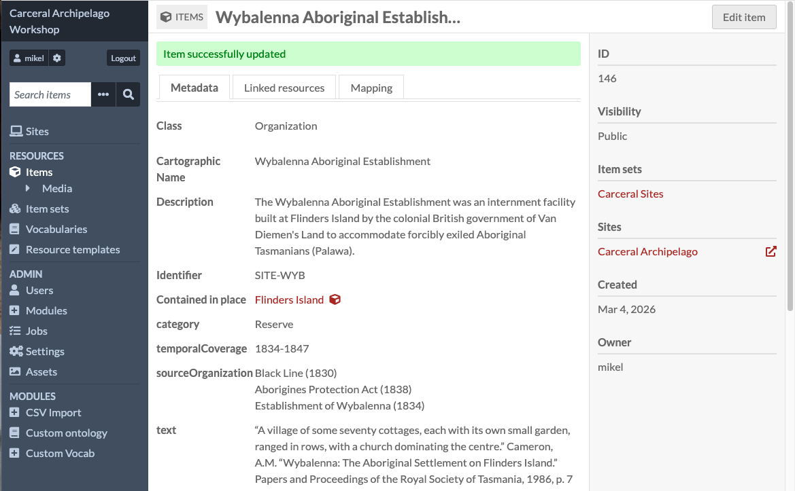

# Editing an item

This is the main page used to edit and create new items in Omeka S -
it looks fairly complicated because this is where you see a lot of
the metadata-nerd aspects of Omeka S, but underneath that it's
relatively simple

If we remember our diagram at the start, it showed what a Carceral
Site looks like as a data object:

This diagram shows one of our carceral site properties, "Cartographic
Name", and what it looks like in the Omeka S edit page:

There's two reasons for all the extra complexity here. One is that
Omeka S properties have to be defined as part of a _vocabulary_ -
these are metadata standards defining what certain terms mean.

You can see the list of vocabularies in this Omeka S on the left panel
of the edit view:

The first four of these are part of our standard distribution. They are
all widely used standards from the library / preservation world, and
we don't need to worry about the details for now.

Although they make the interface more complicated, the value is that
when we use these predefined terms, it will allow us to build an
archived version of the Carceral Archipelago collection which
can be used outside Omeka S, and which has long-term sustainability.

Let's go back to a view of our data object and a view which zooms in
to one of its properties, "Cartographic Name", and what it looks like
in the Omeka S edit page:

The small label "schema:name" tells us that this field is using the
'name' property from schema.org.

The red asterisk (*) is an indication that it's a mandatory field, so
you can't leave it empty.

Underneath the value is an "Add value" button - this allows us to add
extra values. Omeka S allows any property to have multiple values.

The second reason for why the editing view looks so complex is that if
you scroll down, you'll see a lot of empty fields, like 'Region',
'Locality', 'Street address', which aren't in our data model:

These are here because when I imported the spreadsheet, I used a
resource template called Place. A resource template is a predefined
set of properties which can be used to create a new item without
having to add every property manually.

This speeds things up a lot when adding items, but the resource
templates have quite a lot of fields, which are left empty when there's
no value for them.

We'll have a quick look at the standard resource templates at the end
of the workshop.

For now, I've added a description (which I grabbed from Wikipedia) to the item I'm editing - you can do the same. It's probably easiest if we make sure we're not editing the same record.

Once you've added something, click the "Save" button in the top right

This will return you to the item view, with a green message saying
"Item successfully updated". You should be able to see your edits
in the updated item.

