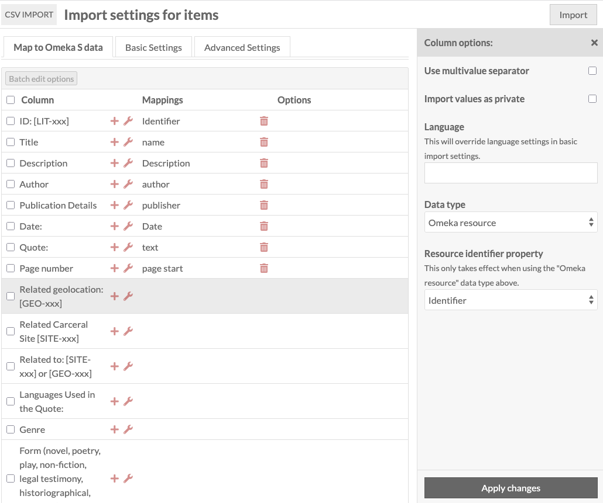

# Uploading more resources

Now we're going to upload a second CSV file of Carceral Sites.

This one can link to the Geolocations we've already added, but this list
also has internal links - relations to other Carceral Sites. Omeka S
can support this kind of link, but not when importing - we will need to
add these links manually after uploading.

We'll use the Place resource template for the Carceral Sites, as we did
with the geolocations.

FIXME = here is where to show how to sanitise lat-longs in Excel,
by adding two extra columns with =VALUE(LAT_COL) to pick up weird
things like n-dashes.

We copy the worksheet out as a CSV, and go through the same process
as before, mapping the columns to fields on Place.

When defining the column mappings for this spreadsheet, we tell Omeka S
to add links to the geolocations already uploaded. We do this by
clicking the wrench for the options panel, and selecting "Omeka Resource"
as the data type - we also need to let Omeka S know what has the id
on the resource we want to link to. We've been using schema.org identifier
so we have to use that (not Dublin Core)

Go through cutting and pasting the Sites, and get to the failed
import with the mysterious error messages

Find and replace the weird en-dash hyphens in the spreadsheet and
start again

Circular references have not been resolved : screenshot

Now we're going to upload a third CSV file with quotations. These
will be imported as Text items.

First problem - saving the sheet as a CSV and exporting gives the
unequal columns error.

Quick fix - select the exact columns and rows, cut and paste into a
new spreadsheet and save that as CSV.

We select Text as the resource template. Here's a screenshot of the
Text template - we can see that the only required field is 'name'.

When we upload, there's a report of identifiers which Omeka S has not
been able to find in the database already [ screenshot ] - this can
be because of typos in the spreadsheet or inconsistencies.

By default, Omeka S will still add resources if it can't resolve a link.

The way to handle this is to either manually add the links in Omeka S,
or delete the items uploaded, fix the spreadsheet and re-import.

Depending on how many errors there are, the first (updating the links
in the website) might be less work.

