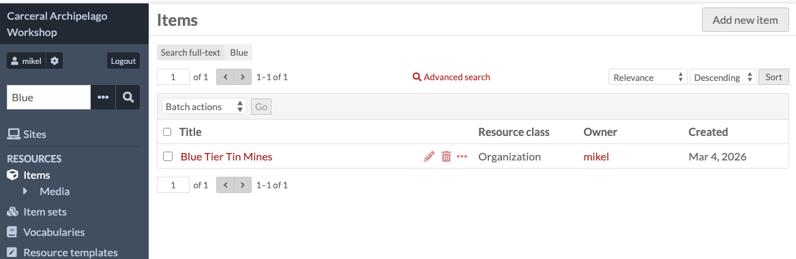
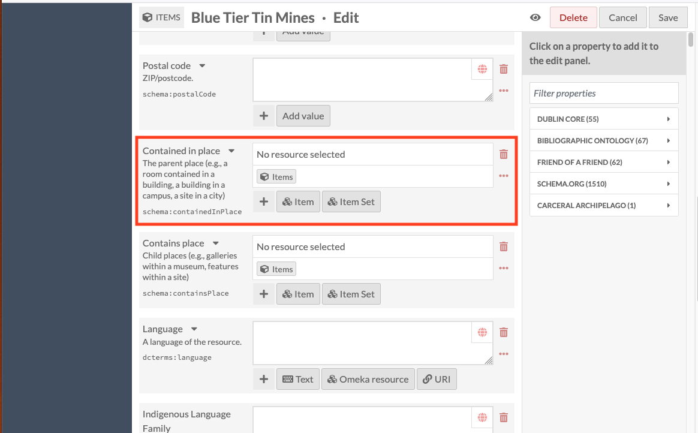
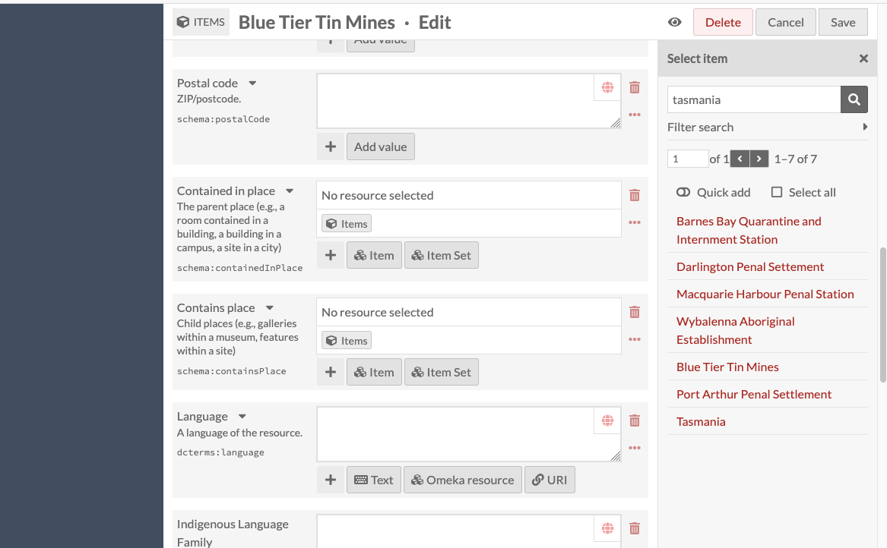
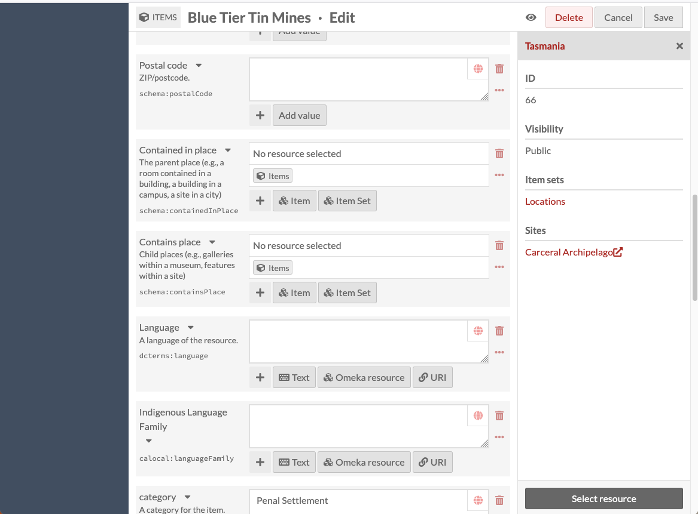
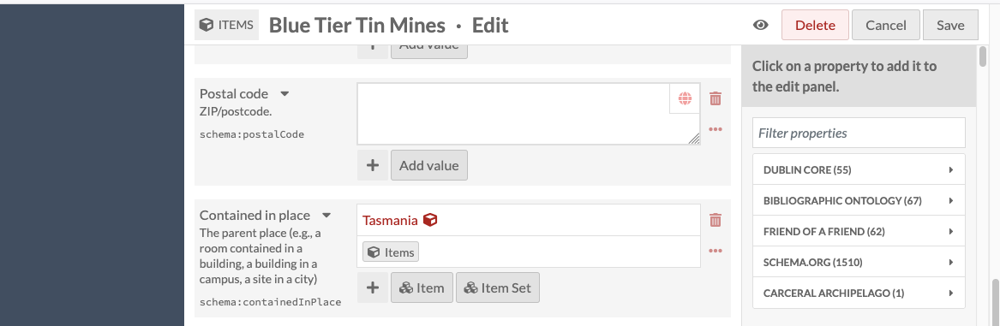
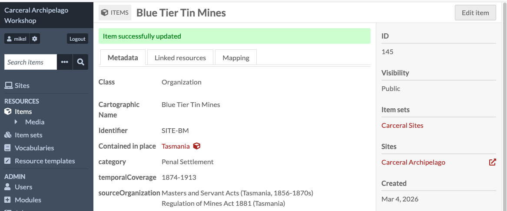
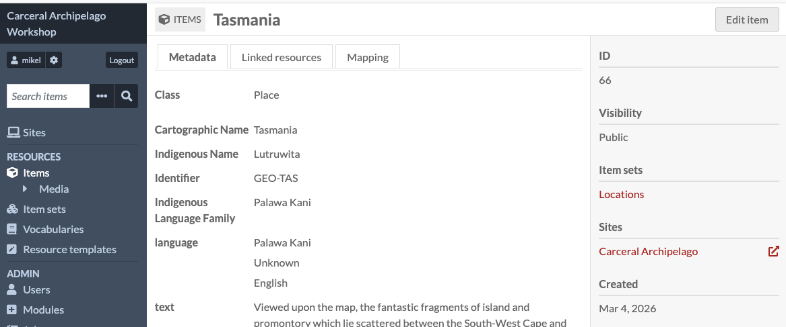
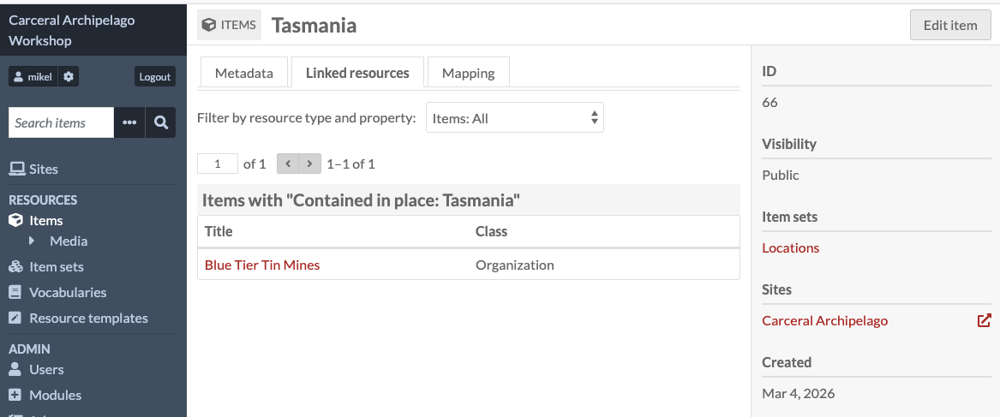

# Linking items

In the last section, we used the edit page to update an item's text
value. Item properties can also be links to other resources (items or
item sets) in the same Omeka S database - this is how Omeka S is used to
model relationships between items.

When I imported the two worksheets from the spreadsheet last week, I
configured the import so that I could upload all of the locations, and
then upload the carceral sites, and tell Omeka S to link the sites to
their locations by the IDs.

One of these (GEO-LTRW) wasn't found in the database, because the
identifier for Tasmania/Lutruwita in the locations sheet was GEO-TAS.

We're going to fix that, and also fix some other records which I unlinked
manually. Here are the four items which have missing links, and the
places which we want to link them to - we should decide who's going to
do which one:

- Blue Tier Tin Mines (Tasmania)
- Norfolk Island Penal Settlement (Norfolk Island)
- Nausori Sugar Plantation (Fiji)
- Fantome Island Lock Hospital and Lazaret (Fantome Island)

To find your record, you can use the search box at the top of the
left-hand navigation panel:

You can then click on the pencil icon to go straight into the edit page
for that item.

We're going to set the link between the carceral site and the location in
a property called "Contained in place" - you'll need to scroll down to
find it. In this screenshot I've highlighted it with a red box

You'll notice that this field looks a bit different to the fields like
"description" that just want a text item - it has "No resource selected"
instead of just being empty, and the interface has a little cube with
"Items" and two more buttons with "Item" and "ItemSet". The little cube
icon is an Omeka S shorthand indicating that this is a property which
is meant to link to another resource (I guess the cube represents an
object)

To find the place we want to link this item to, click the "Items" button.

This will open a panel on the right with the header "Select item", a
search box, and the start of a list of all of the items in Omeka. We can
narrow this down by searching for the name of the place we want.

If you click on the correct location, the side panel changes to a view
of that item. Down the bottom of the panel is a button labelled "Select
resource".

Clicking this will add a link to the place to the "contained in place"
property of our original item - it should update to look something like
this:

Note that the red text "Tasmania" has a little cube after it - this
indicates that it's a link to another resource, not just the word
"Tasmania".

It's important to remember at this point to save our original item -
otherwise the change we've just made won't be stored in the database.

We need to click the "Save" button in the top right hand corner. This
should take us to the item's view, where we should be able to see a red
link to the place in the "Contained in place" field

We'll now look at how Omeka S manages reverse links. In computer systems
links are often one-way - think of how a link on a web page takes you to
another site, but the other website may not have a link which can take
you back.

Relationships in research collections (and in everyday life) are usually
two-way - I am the author of a publication, and one of the publication's
authors is me.

Omeka S has a kind of compromise between these two approaches - its links
are one-way, but it gives you an easy way to find the reverse links.

If you click on the link you've just created, you'll open the item view
for that place:

If you select the second tab, "Linked resources", it gives us a list
of all of the items in the database which have a link pointing to this
item. You should be able to see the item you edited in this link.

