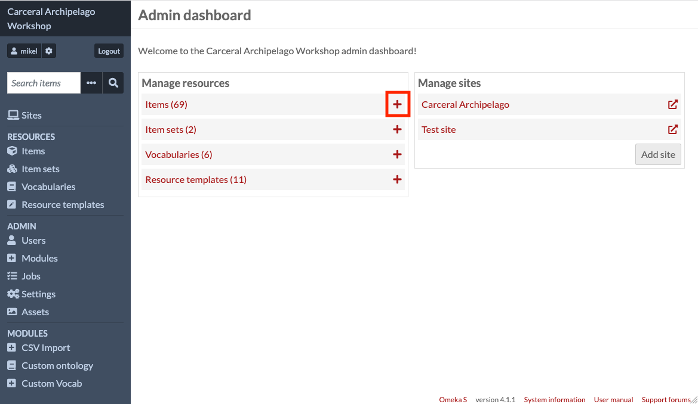
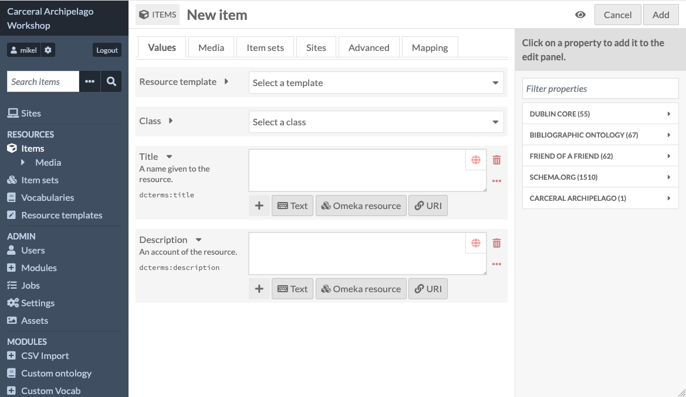
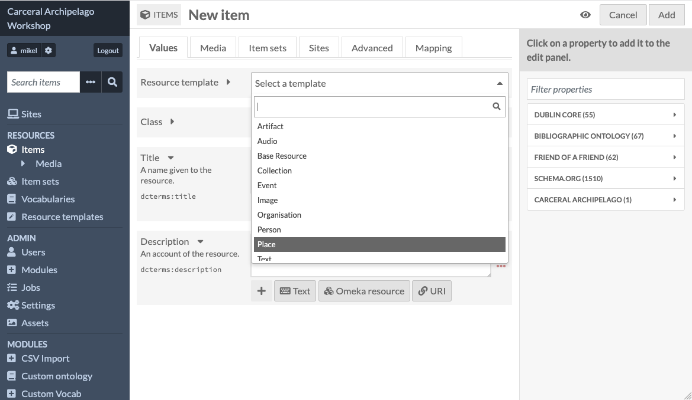
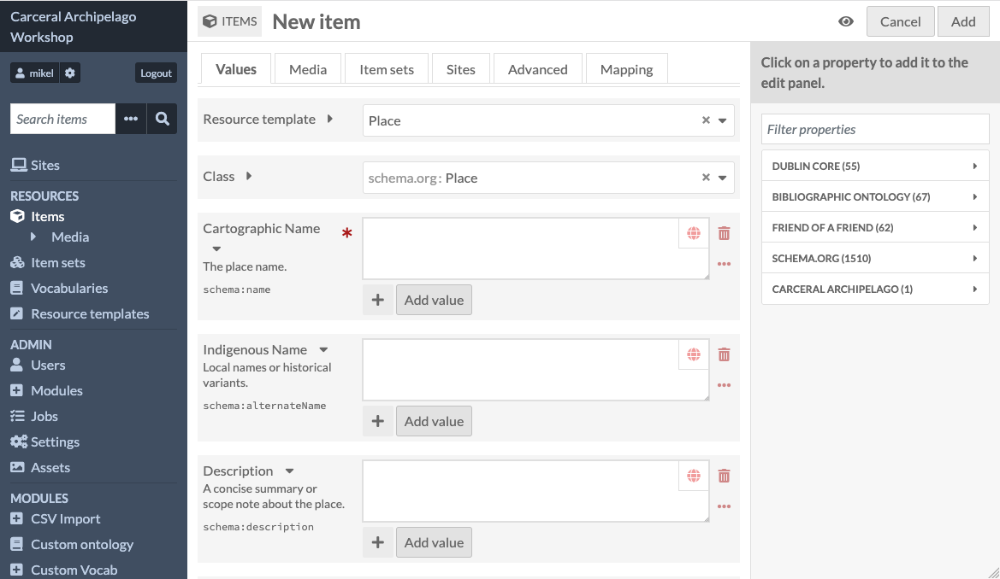
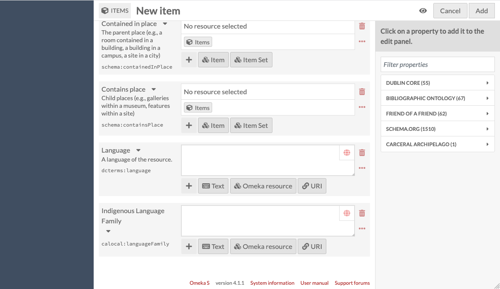
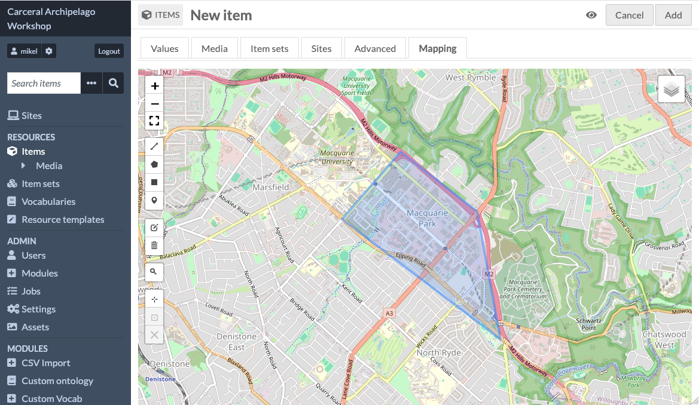
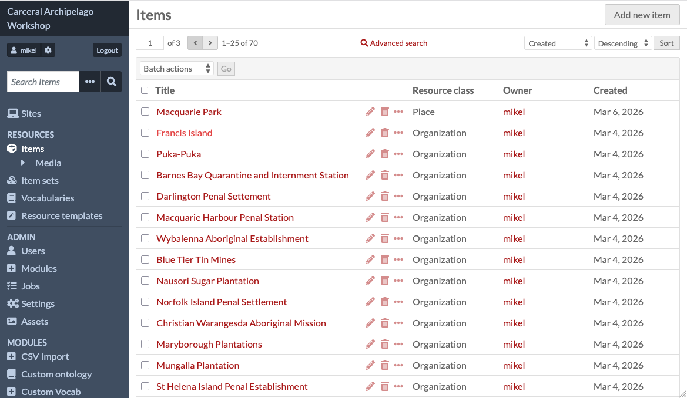

# Adding new items

All of the items we've looked at were created when I imported the
spreadsheets last week. We'll now quickly look at how you can use
Omeka S to create a new item.

Go back to the admin dashboard - you'll notice that next to the
different kinds of resources, there are plus icons.

Click the plus icon next to Items to start to create a new item.

You'll notice that this page looks a lot simpler than when we were
editing the items which I imported last week - that's because when
I imported them, I told Omeka S to use a resource template, which is
a collection of pre-baked properties which you can use so that you
don't have to specify the metadata properties one at a time for new
items.

What we're looking at by default is the bare minimum, a Title and a
Description.

Let's select the Place resource template from the drop-down:

This will add a lot of properties to our new item - you can scroll
down to look at all of them.

Notice that the first two fields, Cartographic Name and Indigenous Name,
match the headings of the columns in the spreadsheets I imported.

This is because when I did the import, I modified the default template
for Place and added a second name field, using the property
"alternateName" from schema.org, and changed the labels on "Name" and
"alternateName" to "Cartographic Name" and Indigenous Name".

If you scroll down to the end of the new item, you can see another field
which I added, Indigenous Language Family:

This is an example of a property which didn't have a good metadata value
in one of the standard vocabularies in this version of Omeka S. I
created a vocabulary called "Carceral Archipelago" and added a property,
"calocal:languageFamily", to the resource template.

One of the drawbacks of Omeka S being a little pedantic about metadata
is that you need to do this kind of configuration to provide extra fields
if they're not covered by the vocabularies. As part of Curated Collections,
we're going to be building out the standard templates based on cases like
this, so that researchers don't need to know how to do this - it should
be easy to add am indigenous name or a language family.

I'm not going to fill out all of this now - what I really want to show you is the mapping panel, as this is how you can create and edit geolocations
against items:

The geolocations on the imported items are points, but Omeka S supports
many other ways of locating an item - a set of line segments, a polygon
(which is what's in the example above), a rectangle or bounding box.

Clicking "Add" in the top left will add your new item to the database.

If you select the item list view from the dashboard, you should be able
to see your new item - and everyone else's - at the top of the list.

