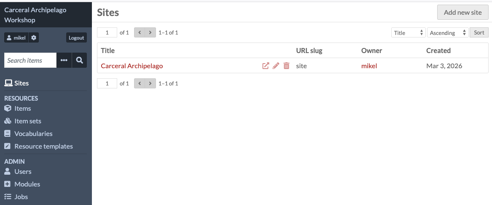
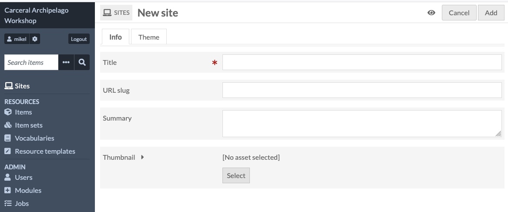
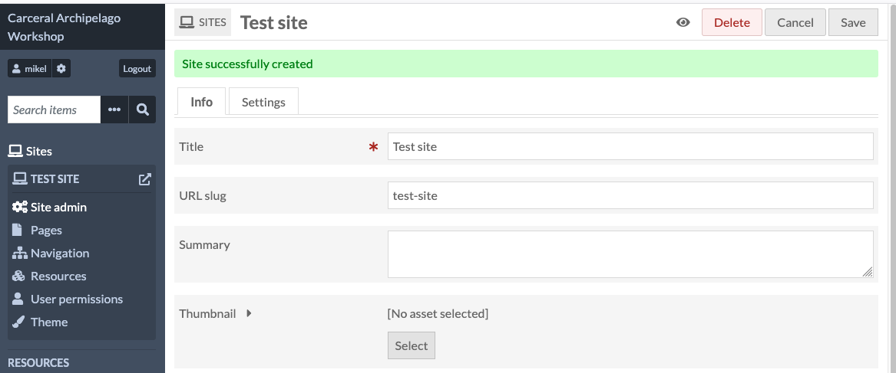
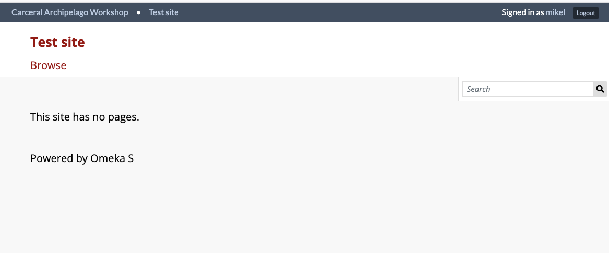

# Create a site

We're now going to create a Site - one Omeka S instance can have
many sites, so we can each create our own.

If you click the "Sites" icon in the left nav panel, you'll get a
list of all of the sites (there's one there already which I created
last week).

Click "Add new site" and you'll see the new site page - this asks you
for a title (which is mandatory as there's a red asterisk) and optionally
a "URL slug" and a summary.

The URL slug is some text which will be used to build the URL for your
site. If you leave this blank, Omeka will create one from your title.

Once you've created it, you should see your site's title in the navigation
panel.

You can visit the site by clicking the little square icon next
to the title: this will take you to an empty site, as we haven't added
any resources to it yet.

