# Create a map

We're going to add a new page to our site with a map showing all of the
carceral sites.

First, we need to assign all of the items in Omeka to the site. Every
site in an Omeka S instance has a collection of items which it "knows
about" and will show up in its searches and visualisations - it's
possible to configure this to automatically include new items, but
by default a new site won't have any items in it. Click the "Resources"
item in the left nav panel, which takes us to the Resources page

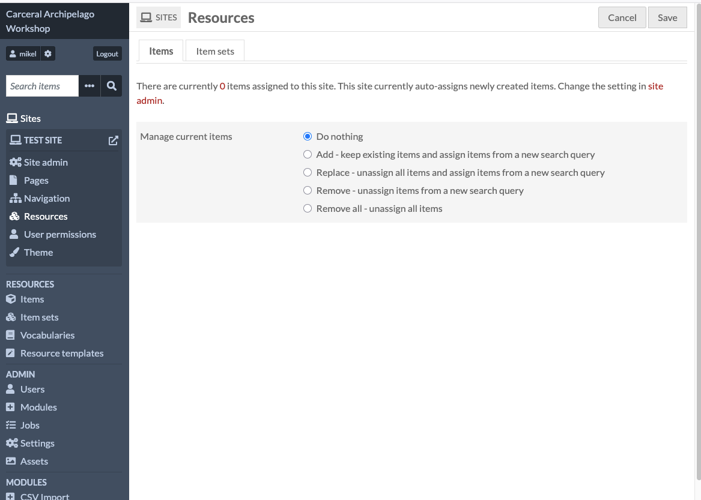

Select the second option, "Add - keep existing items and assign items from a new search query"

Underneath this is a section to define a search query, which we'd use
if we only wanted to add some items to the site. We want to add everything,
so we can leave the query empty.

Click "Save" to add the items to the site.

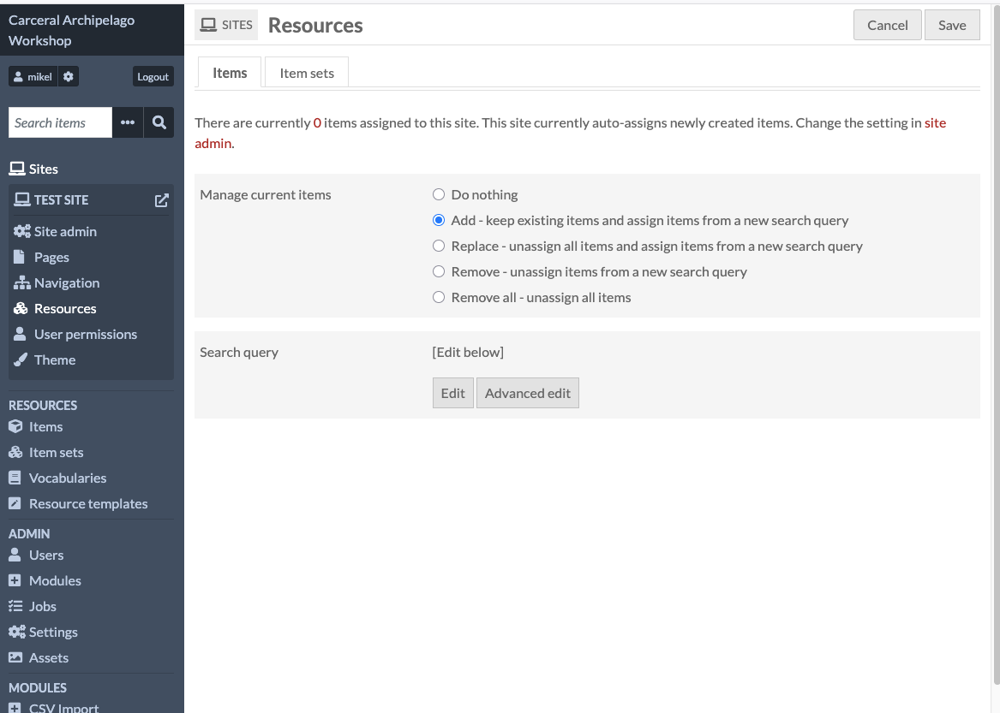

After this you should be able to click in the "Items" entry under
"Resources" on the left nav panel and see a list of all of the items.

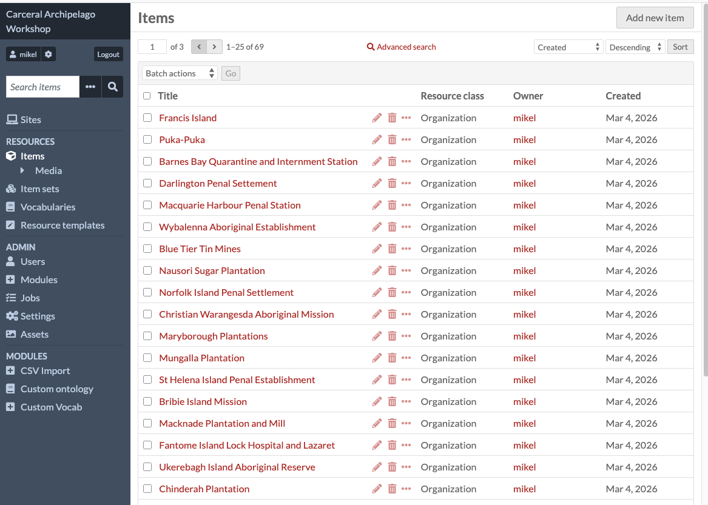

Now that the site has some items, we're ready to put them on a map. Click Pages in the left nav panel, then click "Add new page".

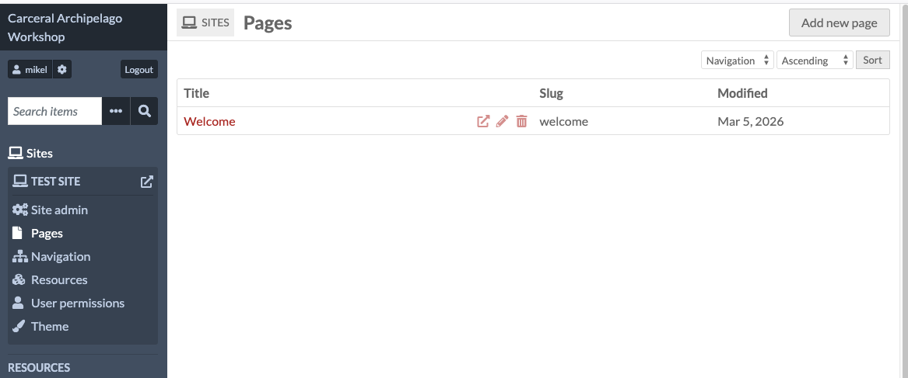

Like the site as a whole, the page needs to have a title, and the URL
slug can be customised but usually will just be the title.

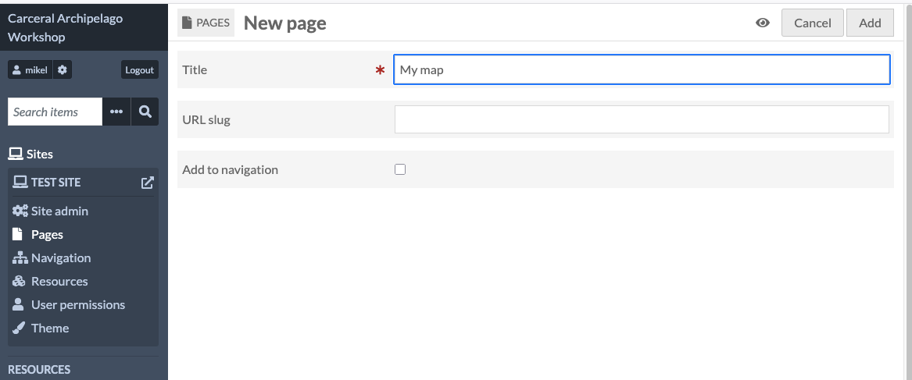

The page editor looks like this:

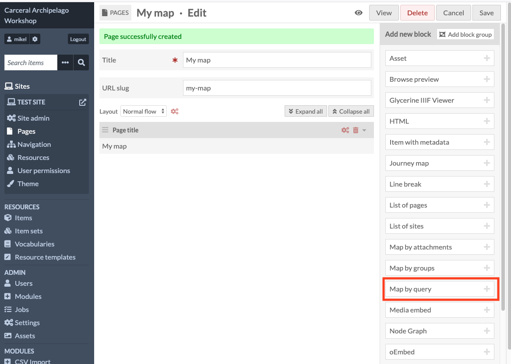

We can build up a page by adding one or more blocks - each block is like
a component which provides a particular bit of web functionality in the
page once it's live. This can be something dynamic and interactive like
a map or a timeline, or just some static content.

We're going to add one block to this - "Map by query"

The "Map by query" has a lot of details in it - we can leave the defaults
for now:

Click the "Save" button in the top left hand corner, and you should get
a green message saying "Page successfully updated":

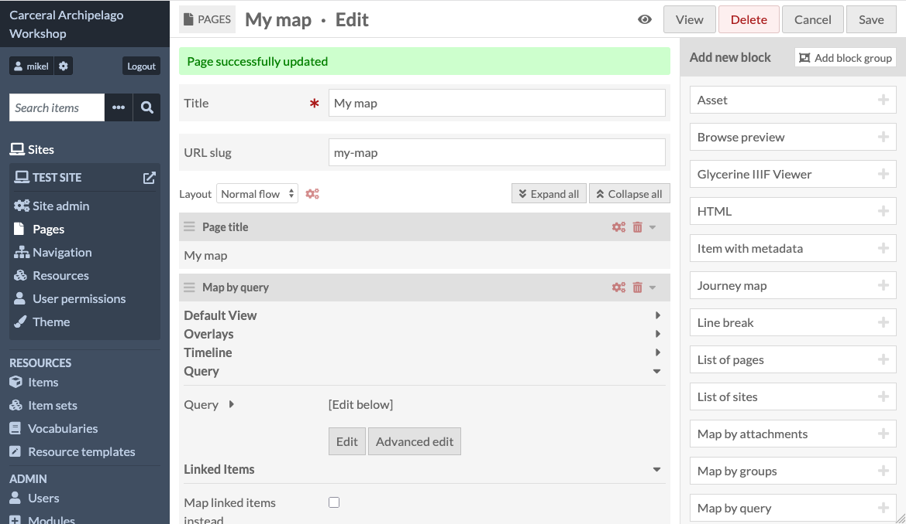

To see the new page, we can click the "View" button, which will open
the page in a new browser tab:

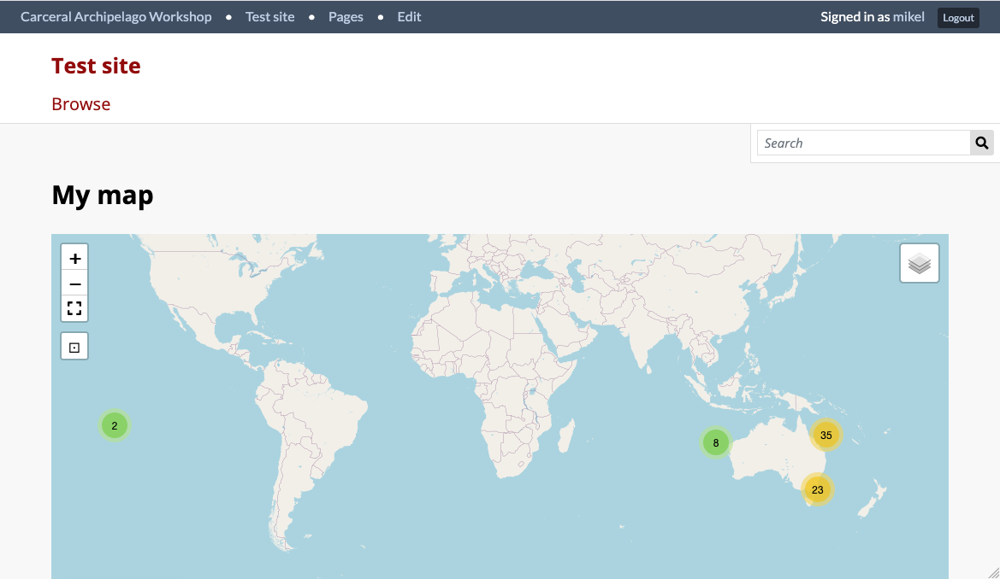

Here is a view of the map zoomed into Tasmania - we can see that Locations
are being rendered as red markers and Carceral Sites as blue-green ones.

Where the mapped items are close together, the map groups them into
clusters with a number showing how many items are in the cluster.

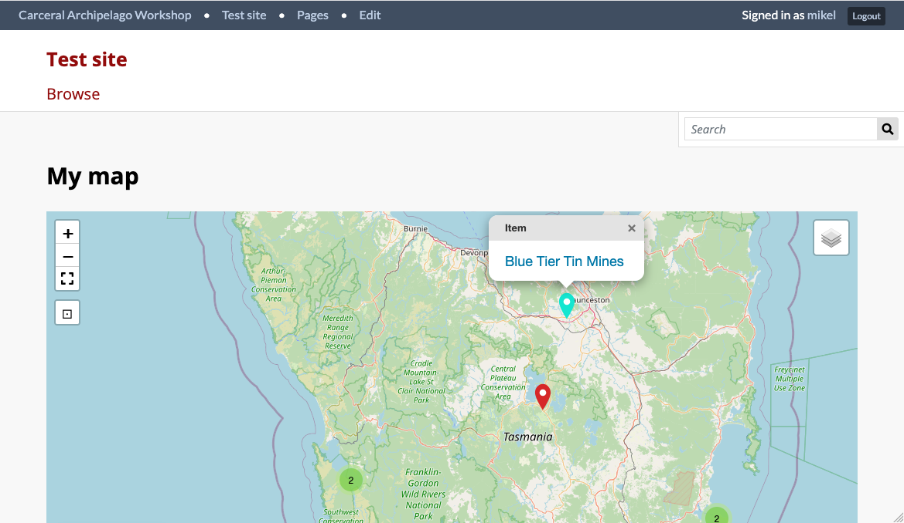

If I click on an item, it shows the name: Blue Tier Tin Mines - and if I
click the link, it will open that item's public facing page.

This isn't very interesting, so now we're going to configure the map to
put some more information into the popups.

Go back to the admin dashboard, select your site, and edit the map you
just created, and then scroll down to the "Map by query" block.  Look
for the field named "Display properties in Popup" - this lets you search
for the properties we want to show the reader.

Unfortunately, we have to specify these by the internal, metadata-ish
names, not the user-friendly labels. "Indigenous name" is using the
schema.org property "alternateName", which is what we have to search for:

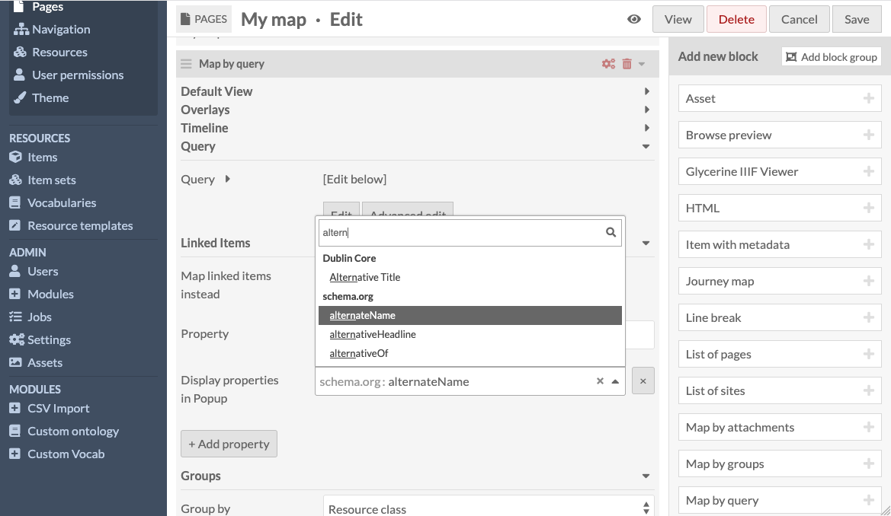

After finding alternateName, we can add more properties by clicking the
"+ Add property" button and doing the same kind of search. Here I've
added the language family, language and text properties - "text" is a
schema.org property which I've used for the quotations.

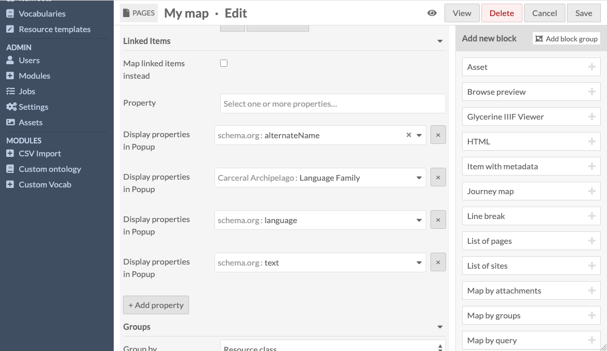

Once you've added some properties, click the "Save" button in the
top right hand corner, and then "View" to see the updated map.

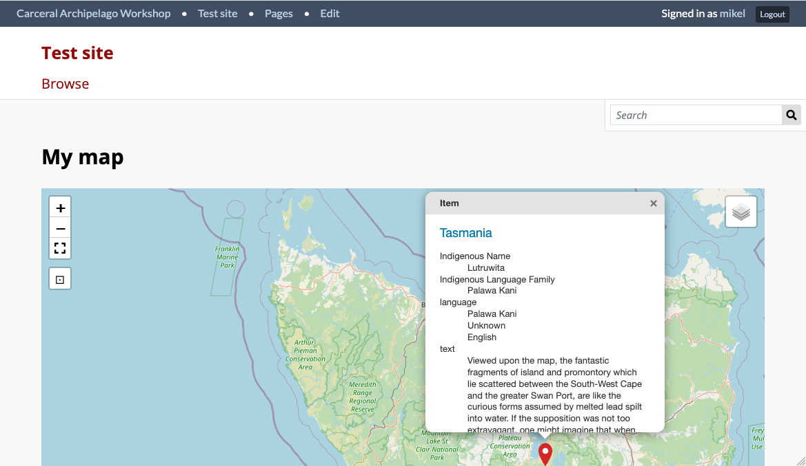

This still needs some work - the scrollbars are ugly and we need to
provide a better label than "text". Our team at SIH are scoping some
development work to make the user experience less basic, but that can
happen in parallel to your work on the collection.

