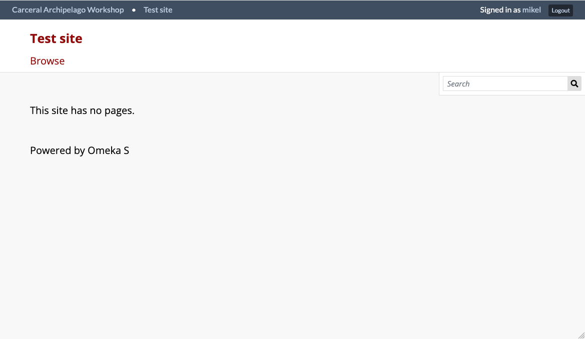
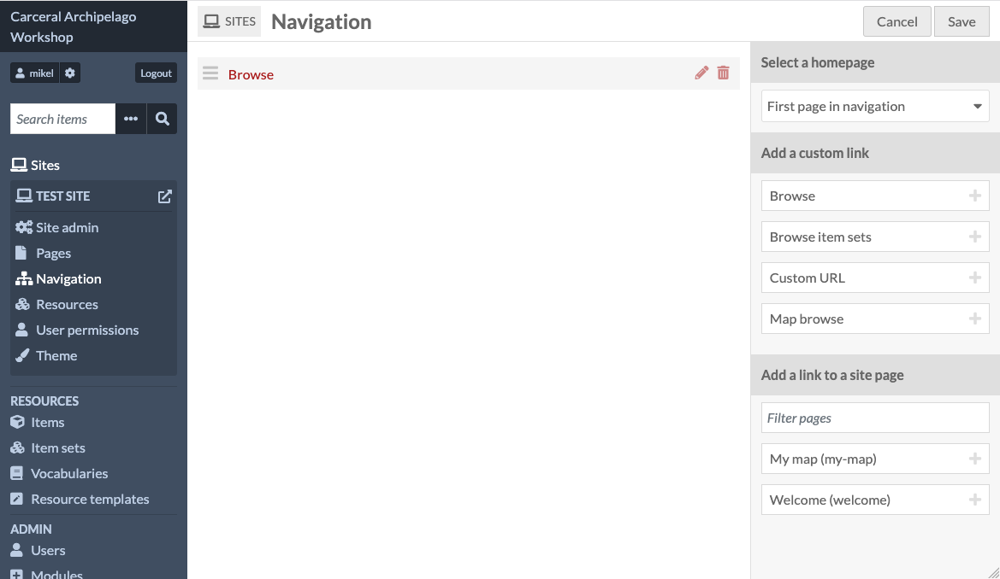
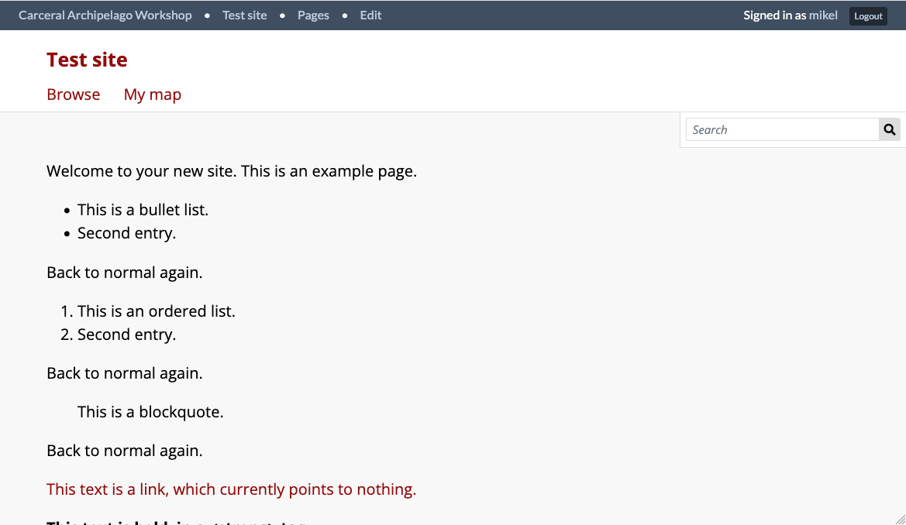
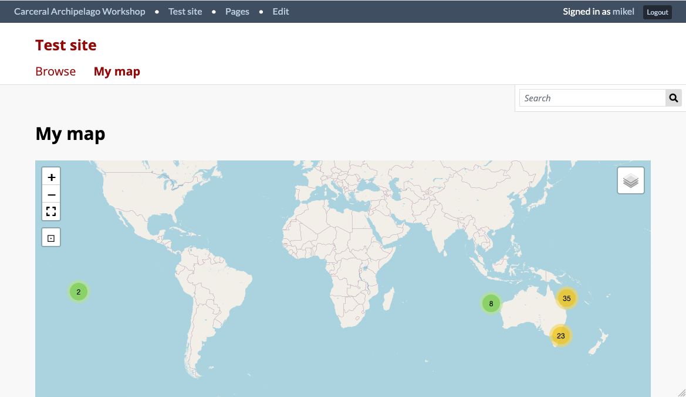

# Site navigation

From the map page, if you click on the site's header, you'll be taken
to the site's front page, which looks a bit disappointing:

For our page to be available to users, we need to add it to the
site's navigation.

Because you're logged in, you should be able to click the "Test site"
link in the dark strap across the top to go straight to the admin
view of the site. Once you do that, click on the "Navigation" item
in your site's pane on the left nav bar:

This is where we build up a list of pages which will be linked across the
top of the site.

The page we've just created, Map, is available on the right hand side,
under "Add a link to a site page". Clicking on "Map" will add  it to the
central pane.

The site also comes with a default page called "Welcome". The Navigation page also lets us pick a "Home page" - this is the page which a visitor
will see when they first arrive at the site. Let's set this to "Welcome".

Once you're finished, click "Save", and then click the little arrow
icon next to your site in the nav panel to see the results:

The front page is now the Welcome page - because we haven't touched the
defaults, it's full of a bunch of sample text, which you can change by
editing the page in the admin interface.

The site's navigation, under the heading, also now includes a link
to your map page: if you click it, you should now be able to view the
map.

This has just been an introduction to building sites in Omeka S - there's
much more which you can do in terms of structuring sites, adding
multimedia, providing different visualisations of the items in the
database, adding dynamic bibliographies and more.
